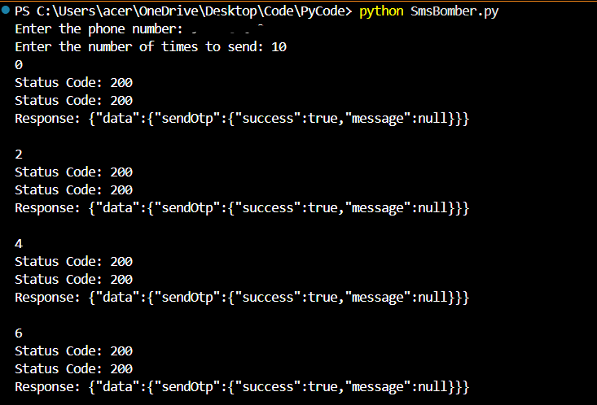

# OTP Request Simulator (Educational)

A Python script that sends repeated OTP requests to a specified number for the purpose of **testing SMS rate-limiting and anti-spam security measures** in a controlled, authorized environment.

> **⚠ Disclaimer:** This tool is intended **strictly for educational purposes** and for testing only on phone numbers you own or have explicit permission to test. Misuse of this tool for malicious purposes is illegal and may lead to criminal charges. The author is not responsible for any misuse.

---

## Features
- Simulates repeated OTP requests using multiple endpoints.
- Alternates between two OTP providers to mimic varied traffic patterns.
- Configurable:
  - Target phone number
  - Number of request cycles

---

## Requirements
- Python 3.x
- `requests` library

Install dependencies:
```bash
pip install requests
```

---

## Usage
- python otp_request_simulator.py
- Enter the target phone number (10-digit format).
- Enter the number of times you want the OTP requests sent.

## Example
- Enter the phone number: 9876543210
- Enter the number of times to send: 5

## Example Output


